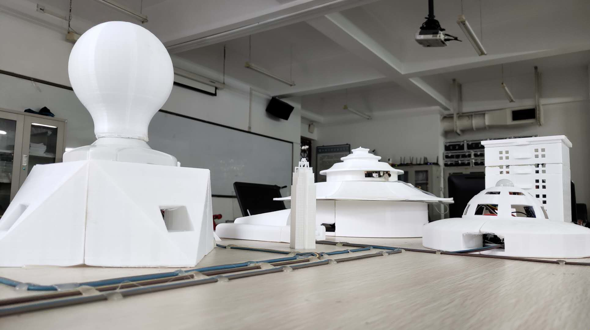
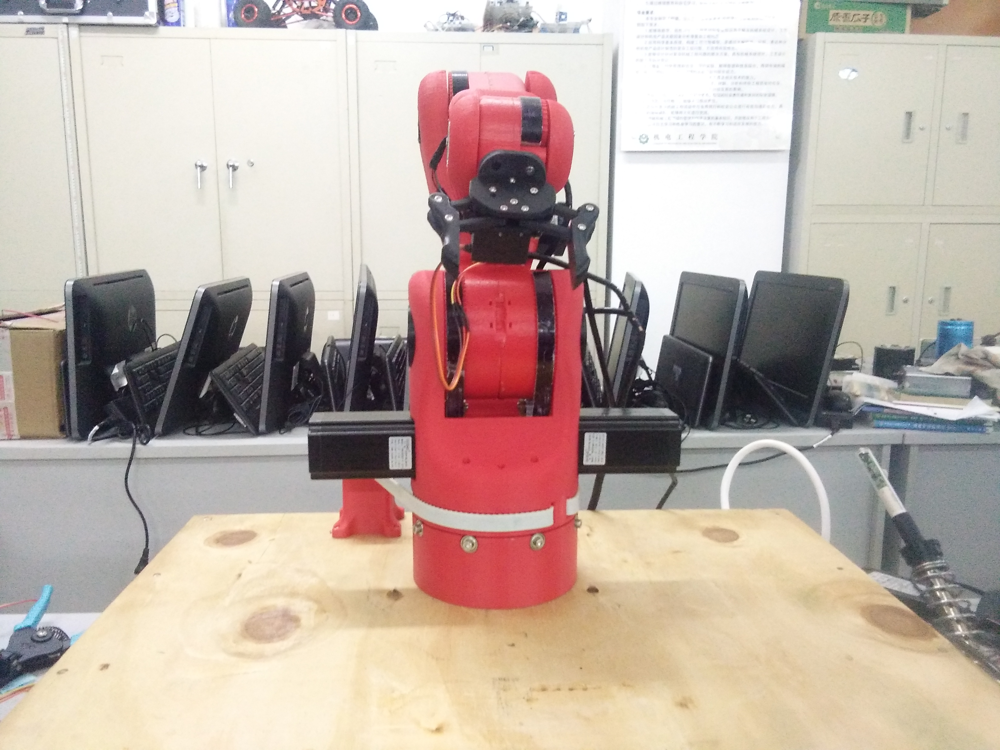
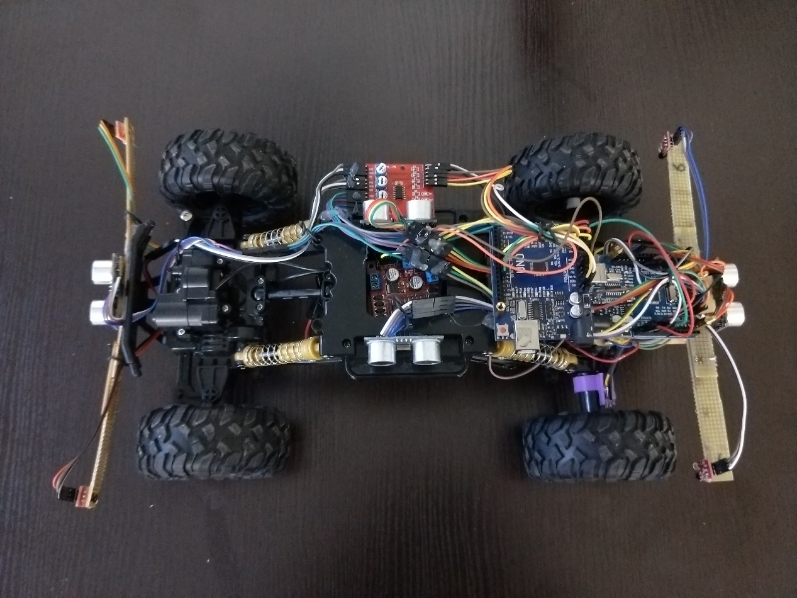
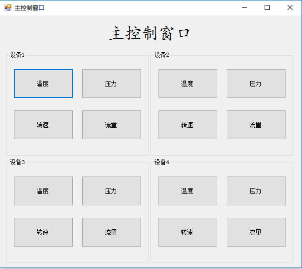

# 蓝宏浩的简历

* [个人信息](#个人信息)
* [联系方式](#联系方式)
* [项目经验](#项目经验)
    * [智能家居实验室改造项目（2017/3-2018/10）](#智能家居实验室改造项目（2017/3-2018/10）)
    * [六轴机械臂教育平台（2017/9-2018/10）](#六轴机械臂教育平台（2017/9-2018/10）)
    * [自动循迹无线视频遥控智能安全汽车模型（2018/3-2018/6）](#自动循迹无线视频遥控智能安全汽车模型（2018/3-2018/6）)
    * [多用途复杂地形救援机器人的设计与制作（2018/4-2018/6）](#多用途复杂地形救援机器人的设计与制作（2018/4-2018/6）)
    * [数控机床监控（2017/4-2017/5）](#数控机床监控（2017/4-2017/5）)
* [个人经历](#个人经历)
* [校内职务](#校内职务)
    * [能动量机器人创新团队队长（2017/10-至今）](#能动量机器人创新团队队长（2017/10-至今）)
    * [工程学人科技协会社团机器人组组长（2017/6-2018/9）](#工程学人科技协会社团机器人组组长（2017/6-2018/9）)
    * [工程学人科技协会社团乔木宣传部负责人（2017/9-2018/10）](#工程学人科技协会社团乔木宣传部负责人（2017/9-2018/10）)
* [获奖证书](#获奖证书)
* [技能证书](#技能证书)
* [技能清单](#技能清单)
* [个人评价](#个人评价)
* [致谢](#致谢)

## 个人信息

* 蓝宏浩/男/1997
* 机械电子工程/本科/黑龙江工程学院
* 博客：[blog.lanhonghao.cn](blog.lanhonghao.cn)
* Github：[github.com/lanhonghao](github.com/lanhonghao)

## 联系方式

* 手机：18319368871
* Email：[Lanhonghao@126.com](mailto:Lanhonghao@126.com)
* QQ：1039167461
* 微信号：18319368871

- - -
## 项目经验

### 智能家居实验室改造项目（2017/3-2018/10）

**项目描述**	

智能家居实验室试点改造项目是省级重点大学生创新项目。做一套符合学校工业机器人实验室的智能家居布置。智能家居实验室试点改造项目是为了实验室环境进行设计的。智能家居实验室试点改造项目可以为实验室提升安全性、便利性，并实现节能环保的使用环境。智能家居实验室试点改造项目的实施可以改变固有的管理方式，更加便捷有效地掌握实验室的各方面信息，远程控制设备仪器的操作使用。由于不方便展示，于是制作了智能家居实验室改造项目展示板，方便更直观看到效果。

**责任描述** 	

总负责人。全套设备的软硬件的设计和调试。

**成果说明**

* 省级重点大学生创新项目

### 六轴机械臂教育平台（2017/9-2018/10）

**项目描述**

机械臂，在工业上主要用于生产线的自动搬运、装配、焊接、喷涂等工业现场中有广泛的应用。六自由度机械臂是具有成熟完备的运动控制技术与先进的设计和教学理念有机结合的产物,既满足工业现场要求，也是教学、科研机构进行运动规划和编程系统设计的理想对象。 该无动力型机械臂的主体结构采用3D打印技术，在满足机械结构强度要求的前提下，具有机械结构质量轻，成本低，适合用于教学演示和大学生创新训练。该项目基于单片机控制，程序修改方便，控制方便和易于操作，该机械臂项目以大学生机器人教育、机器人人才的培养为目的，支持师生对机械臂进行轨迹规划和应用开发研究。

**责任描述** 	  	 

项目成员。上位机软件设计，硬件的部分搭建。

**成果说明**

- 2018年“邮储银行杯”黑龙江省智能机器人竞赛创新设计一等奖

 

### 自动循迹无线视频遥控智能安全汽车模型（2018/3-2018/6）

**项目描述**

本设计是一种基于单片机控制的简易自动寻迹、无线视频遥控和集成安全判断系统的智能汽车设计方案,包括智能汽车系统构成硬件设计及上位机软件设计控制方法。 在简易自动寻迹模式下，智能汽车以arduino   uno为控制核心,用单片机产生pwm波,控制小车速度。智能汽车自动寻迹利用红外光电传感器对路面黑色轨迹进行检测,并将路面检测信号反馈给单片机。单片机对采集到的信号予以分析判断,及时控制驱动电机以调整智能汽车转向,从而使智能汽车能够沿着双黑色轨迹道路自动行驶,实现小车自动寻迹的目的，以此达到模仿真实生活中汽车在道路上的行驶状态。 智能汽车无线遥控是基于C#开发的一款在Windows系统环境下运行的智能汽车上位机,借助于WiFi技术和ZigBee技术设计和实现的一种无线遥控智能汽车新的解决方案。设计以电脑上位机控制平台、WiFi通讯模块、ZigBee数传模块、电机驱动模块等硬件模块组成的智能汽车模型。实现智能汽车的前进、后退、前左转弯、前右转弯、后左转弯、后右转弯等实时控制功能。并加入超声波模块检测智能汽车模型车外环境。

**责任描述** 	

总负责人。全套设备的软硬件的设计和调试。

**成果说明**

- 2018年全国机器人与人工智能技术大赛（黑龙江赛区）智能汽车设计（模型组）冠军（一等奖）

 

### 多用途复杂地形救援机器人的设计与制作（2018/4-2018/6）

**项目描述**

在Arduino单片机与WI-FI通讯技术基础上，进行设计并制作一种多用途复杂地形救援机器人。该机器人具有远程图像传输，WI-FI远程控制，空气检测，生命特征检测功能。用来代替特殊环境人工搜救，降低救援人员的伤亡数量。 设计内容有整体机械结构及行走方案设计，下位机系统软硬件设计，上位机软件设计。通过机器人进行搜索，实时对上位机进行数据反馈，以确认生命特征、环境以及地貌等信息。为搜救人员提供有效、准确的信息。 该救援机器人能够准确传回清晰图像，生命特征检测，易燃易爆气体检测，能够连续翻越障碍物进行搜索，对即将救援地点进行全方位了解，从而达到降低危险的目的。

**责任描述** 		

项目成员。Arduino单片机的编程，WI-FI通讯的搭建，上位机软件设计。

 

### 数控机床监控（2017/4-2017/5）

**项目描述**

该数控机床监控上位机使用C#语言编写。该上位机通过主界面窗口进行对子窗口的调用，分别监控机床设备的温度、压力、转速和流量。针对于子窗口程序的设计和优化，使子窗口的使用更方便更实用。针对于子窗口主程序，一共由五大模块组成，分别是与主窗口之间参数的传递、与下位机之间的串口通信、数据的波形化显示、实时数据的显示和报警系统。

**责任描述** 	

总负责人。整套上位机的设计，以及Arduino检测装置。

------

## 个人经历

**校内经历**

- 2016年9月	参加工程学人科技协会社团
- 2016年10月	学习Arduino单片机
- 2016年12月	加入机械创新实验室
- 2016年12月	参加2016“哈工海渡杯”工业机器人虚拟仿真大赛决赛
- 2017年4月	学习C#上位机编写
- 2017年5月	使用C#完成数控机床监控上位机设计
- 2017年6月	参加第十五届“挑战杯”黑龙江省大学生课外学术科技作品竞赛
- 2017年6月	作为负责人申请黑龙江省大学生创新创业训练计划项目（智能家居实验室试点改造项目）并被批准为省级重点大学生创新项目
- 2017年6月	成为“灵莹科技公司”大学生创业实践项目成员
- 2017年6月	竞选工程学人科技协会社团机器人组组长成功
- 2017年7月	参加2017年"大庆杯"第十九届全国机器人锦标赛暨第八届国际仿人机器人奥林匹克大赛
- 2017年8月	学习linux操作系统，了解linux基本的命令操作
- 2017年9月	创建工程学人科技协会社团乔木宣传部兼任负责人
- 2017年9月	参加TRCC第六届全国机器人创意设计大赛暨第七届黑龙江省高校“龙建杯”创新创业机器人设计大赛
- 2017年10月	担任能动量机器人创新团队队长
- 2017年10月	作为学生领队带队参加2017年全国竞技机器人邀请赛
- 2018年5月	使用C#完成多用途复杂地形救援机器人的上位机设计
- 2018年6月	参加“儿童防走失可穿戴无线装置”大学生创业训练项目成员
- 2018年6月	作为学生领队带队参加全国机器人与人工智能技术大赛（黑龙江赛区）
- 2018年6月	担任机械创新实验室学生负责人
- 2018年9月	使用C#完成六轴机械臂教育平台的上位机设计
- 2018年10月	作为学生领队带队参加2018年“邮储银行杯”黑龙江省智能机器人竞赛
- 2019年5月	负责水下滑翔机项目的设计与制作。

**校外经历**

- 学校组织校外见习：中国兵器，大顶子山水电站，江苏哈工海渡工业机器人有限公司

------

## 校内职务

### 能动量机器人创新团队队长（2017/10-至今） 

**职务描述**	

能动量机器人创新团队队长主要职能负责比赛前与比赛主办方沟通比赛规则，比赛的费用以及出行时间，人数，住宿以及负责团队比赛项目人员配置，器材准备，比赛预算，耗材购买，票据，比赛总结撰写。在职期间参加国家级比赛3个，省级比赛1个，团队获奖项目十余项。

### 工程学人科技协会社团机器人组组长（2017/6-2018/9）

**职务描述**

主要职责是和搭档共同参与社团纳新活动，负责大一新成员的培训，主要内容为人形机器人编程知识以及基本的电路知识，组织机器人组成员的日常培训活动，与会长沟通汇报阶段成果

### 工程学人科技协会社团乔木宣传部负责人（2017/9-2018/10） 

**职务描述**

主要负责对于微信公众号的运营，对于每次比赛前的宣传招募新人

 

------

## 获奖证书

- 2016-2017学年第一学期三等奖学金
- 2016-2017学年第二学期三等奖学金
- 2017-2018学年第一学期三等奖学金
- 2018-2019学年第一学期三等奖学金
- 第十五届“挑战杯”黑龙江省大学生课外学术科技作品竞赛	二等奖
- 2017年"大庆杯"第十九届全国机器人锦标赛暨第八届国际仿人机器人奥林匹克大赛仿人机器人八人舞比赛		一等奖
- 2017年"大庆杯"第十九届全国机器人锦标赛暨第八届国际仿人机器人奥林匹克大赛宠物机器人智能化创新设计比赛	一等奖
- TRCC第六届全国机器人创意设计大赛暨第七届黑龙江省高校“龙建杯”创新创业机器人设计大赛机器人舞台表演类戏曲	一等奖
- TRCC第六届全国机器人创意设计大赛暨第七届黑龙江省高校“龙建杯”创新创业机器人设计大赛工业机器人技术创意创新	一等奖
- 2017年全国竞技机器人邀请赛无人机专项二等奖
- 2017年全国竞技机器人邀请赛机器人舞蹈赛（多人舞）一等奖
- 全国机器人与人工智能技术大赛（黑龙江赛区）智能汽车设计（模型组）冠军（一等奖）
- 全国机器人与人工智能技术大赛（黑龙江赛区）智能文化创意设计二等奖
- 2018年“邮储银行杯”黑龙江省智能机器人竞赛创新设计	一等奖

------

## 技能证书

- C1驾驶证
- 三维数字化技术认证证书（UG）
- 全国计算机辅助技术培训项目二维CAD（机械设计方向）证书

------

## 技能清单

- 熟悉**Arduino** 平台**C语言**程序设计,**arduino单片机程序设计及电路设计**,接触raspberry pi, plc程序设计。
- 有**模电数电**调试经验。
- 熟悉**UG/Solidworks** 3D**设计**。
-  熟悉使用**C#开发上位机软件**
- 熟悉Html，能够制作简单的静态网页。
- 了解Linux命令行基础操作。
- 熟练使用**AltiumDesigner, keil** ,Cura,RobotStudio, **Autocad**完成相关设计。
- 熟练使用**office**软件完成文件处理。

------

## 个人评价

- 大学阶段有较多机器人类竞赛经历，**动手能力强，有较强的创新能力**。
- 热爱**机器人制作**，热爱**DIY创作**，热爱**开源**。
- 乐于钻研，勤奋务实，热情随和。
- 爱好阅读，足球运动。

------

## 致谢

感谢您花时间阅读我的简历，期待能有机会和您共事。

 

 

PDF简历下载:[点击这里](./蓝宏浩-18319368871.pdf)
